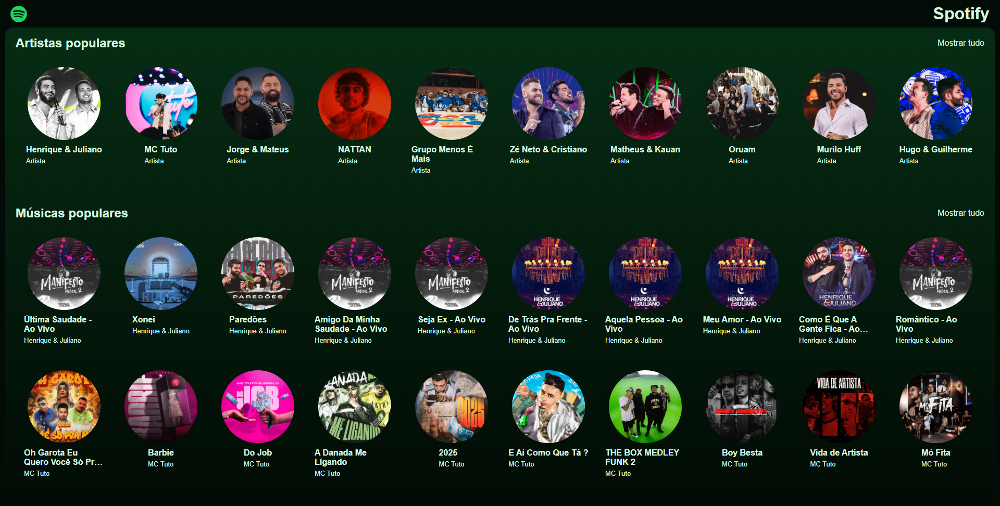

# 🎵 Spotify-Project

Clone do Spotify desenvolvido com **React**, **Vite**, **Node.js**, **Express** e **MongoDB**. Este projeto simula a experiência de streaming de música, incluindo páginas de artistas, músicas populares, player funcional, navegação e integração com um banco de dados para gerenciamento de músicas e artistas.

### 🔗 Acesse o projeto: [Spotify Clone](https://spotify-project-bpa2.onrender.com/)

---

## 📸 Demonstração



---

## 🚀 Funcionalidades

- Página inicial com listagem de músicas e artistas populares.
- Navegação fluida entre páginas de artistas e músicas.
- Player funcional com play, pause, próxima e anterior música.
- Barra de progresso dinâmica e cálculo preciso de tempo.
- Integração com MongoDB para armazenamento de músicas e artistas.
- Design responsivo e intuitivo.

---

## 🛠️ Tecnologias Utilizadas

### Front-end:
- **React** com **Vite** para um desenvolvimento ágil e rápido.
- **React Router Dom** para navegação entre páginas.
- **Axios** para consumo de API.
- **FontAwesome** para ícones personalizados.
- **CSS** customizado para estilização responsiva.

### Back-end:
- **Node.js** com **Express** para construção da API.
- **MongoDB** com **Atlas** para banco de dados na nuvem.
- **MongoDB Driver** para integração com o banco de dados.

---

## ⚙️ Pré-requisitos

Certifique-se de ter instalado na sua máquina:
- **Node.js** (versão LTS recomendada)
- **NPM** ou **Yarn**
- **MongoDB Atlas** ou **MongoDB Local**

---

## 🔧 Instalação e Configuração

### Clone o repositório:
git clone https://github.com/alex518123/Spotify-Project.git
cd seu-repositorio

Instale as dependências do Front-end:

cd front-end

npm install

Instale as dependências do Back-end:

cd ../back-end

npm install

---

🚀 Como Rodar o Projeto

Rodando o Front-end:

cd front-end

npm run dev

Rodando o Back-end:

cd ../back-end

node server.js

O Front-end estará disponível em: http://localhost:5173
O Back-end estará disponível em: http://localhost:3001


🔗 Endpoints da API
Base URL: http://localhost:3001

Endpoints Disponíveis:
GET /artists - Retorna todos os artistas.
GET /songs - Retorna todas as músicas.

---

📁 Estrutura do Projeto
```
Spotify-Project/
│   README.md
│
├── front-end/
│   └── src/
│       ├── api/
│       ├── assets/
│       │   ├── database/        # JSON de músicas e artistas (originais)
│       │   └── images/          # Imagens de músicas e artistas
│       └── components/
│           ├── Header.jsx
│           ├── Main.jsx
│           ├── Player.jsx
│           ├── ItemList.jsx
│           └── ...
│
└── back-end/
    ├── api/
    │   ├── connect.js           # Conexão com MongoDB
    │   ├── insertMany.js        # Inserção de dados no MongoDB
    │   └── server.js            # Configuração do servidor Express
    └
```

---

🌐 Integração com o MongoDB

**connect.js:** Realiza a conexão com o MongoDB Atlas usando MongoClient.

**insertMany.js:** Transfere dados do front-end para o banco de dados.

**server.js:** Configura rotas para as coleções artists e songs.

---

📦 Dados Utilizados

Os dados estão localizados em:

```
front-end/src/assets/database/
│   ├── artists.js               # Dados dos artistas
│   └── songs.js                 # Dados das músicas
```

Importante: No MongoDB, as coleções são renomeadas para artists e songs, excluindo o campo id para evitar conflitos.

---

🔥 Funcionalidades Detalhadas
🎶 Player de Música:
Play/Pause utilizando o hook useRef() para manipular o áudio.

Controle de Tempo:
formatTime() para formatar o tempo em MM:SS.
timeInSeconds() para converter strings de tempo em segundos.
Barra de Progresso:
Atualiza dinamicamente com setInterval() e style.setProperty().
📑 Listagem de Artistas e Músicas:
ItemList.jsx: Responsável por listar os artistas e músicas.
SingleItem.jsx: Exibe cada item com imagem, título e botão de play.
SongItem.jsx: Mostra detalhes das músicas, incluindo tempo de duração.

---

📝 Considerações Finais
Este projeto foi desenvolvido como parte de um estudo prático de React, Node.js e MongoDB, simulando as funcionalidades essenciais do Spotify.

---

## 📬 Contato

📧 **E-mail:** alexresende675@gmail.com

🐙 **GitHub:** [alex518123](https://github.com/alex518123)

---

📜 Licença
Este projeto é open-source e está licenciado sob a MIT License.

---

Desenvolvido por: Alexander Resende [Dê uma olhada no meu portfólio!]()


